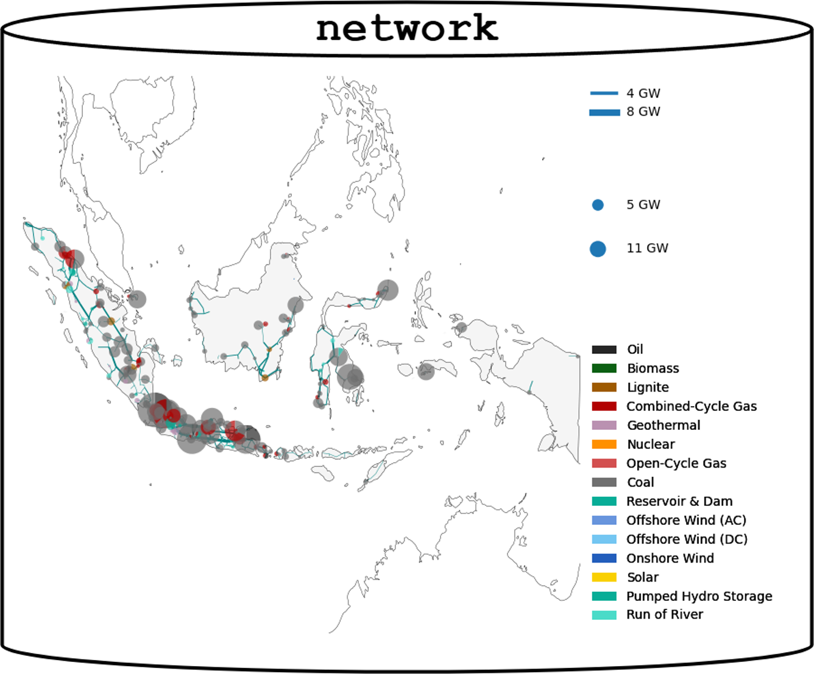
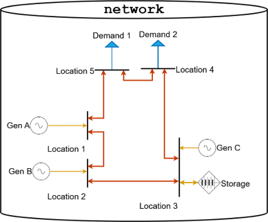
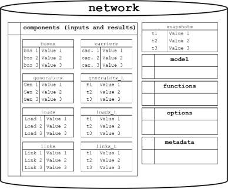
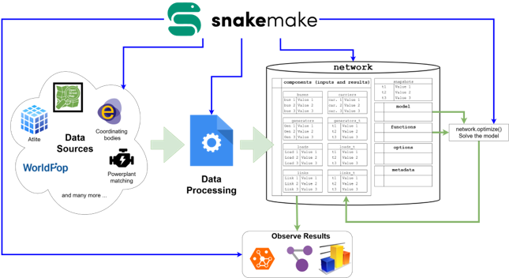

# ⚡ `hello-pypsa`

The `hello-pypsa` repository is an initiative by **Open Energy Transition (OET)** to introduce users to the core concepts of energy system modeling using the [PyPSA](https://pypsa.org) toolbox. It provides a hands-on training notebook that runs directly in [Google Colab](https://colab.research.google.com).

This repository complements the video available on the **pypsa-meets-earth** YouTube channel:

The presentation for this repository can be viewed at:

---

## 🧠 Key Concepts

### 1️⃣ Energy Systems as Networks  
Energy systems can be represented as network models that describe how energy flows across infrastructure.

**PyPSA Philippines** – Arizeo C. Salacm, [pypsa-ph](https://zenodo.org/records/1558657)

---

### 2️⃣ Components in PyPSA  
A PyPSA network is built from components such as `buses`, `lines`, `links`, `generators`, and `loads`.

---

### 3️⃣ The PyPSA Model  
A PyPSA `Network` object contains:
- **Data** (stored as pandas DataFrames),
- **Methods** (for simulation, optimization, etc.),
- **Constraints** (that define system behavior), and
- **Solver options** (to control optimization settings).

---

### 4️⃣ Reproducible Workflows with Snakemake  
Large-scale modeling efforts benefit from structured workflows. We use [Snakemake](https://snakemake.readthedocs.io) to manage the end-to-end process—from data collection to model solving and results analysis.

The typical modeling workflow includes:
- Data collection and import  
- Constraint formulation and application  
- Model solving  
- Results review and analysis  

🔁 **Green arrows** represent process flow  
🔷 **Blue arrows** represent coordination between steps

> 🧩 Note: Snakemake workflows are **not covered** in this notebook. For full-featured modeling environments, refer to:
> - [PyPSA-Eur](https://github.com/PyPSA/pypsa-eur)  
> - [PyPSA Meets Earth](https://github.com/PyPSA/pypsa-earth)  

---

## 📓 About This Repository

This repository includes:

- Two **training notebooks** that introduces the PyPSA framework and walks through building a basic energy system model.
- A **blank Excel template** for creating your own model.
- A **complete example** of a simplified South African power system divided into 9 provincial nodes and connected using `links`.

The notebook is **self-contained** and designed to run in **Google Colab**, so no local setup is needed.

Users are encouraged to refer to the official [PyPSA documentation](https://pypsa.readthedocs.io) for detailed guidance on model components, usage, and advanced features.

---

## ☁️ Running in Google Colab

Google Colab provides a virtual machine in the cloud. However:

- All data and installed packages are lost when a session ends.
- To preserve your work, the notebook:
  - Mounts your **Google Drive** to save files persistently.
  - Optionally pulls the latest version of this GitHub repository.
  - Creates timestamped **backups** of your existing work when pulling updates.

> **Note:** To interact with the Excel notebooks, open the spreadsheets in Google Drive using Google Sheets. Adjust values as needed, then run the notebook.  
> The notebook is linked to your Drive, so it will reference the updated Google Sheet. However, be aware that changes in Google Sheets may take a few moments to sync with Drive, which can occasionally cause a delay in reflecting updates during execution.

⚠️ To use these features, you will need a **Google account** and will be asked to authorize access to your Drive.

> 🔒 Concerned about security? See [Google Colab – Drive Access Permissions](https://research.google.com/colaboratory/faq.html#drive) for more details.

---

## 🛠️ Get Started

Open the notebook in Colab using the badge below:

---

## 📬 Contact

For questions, reach out to [Open Energy Transition](https://openenergytransition.org/contact).

## Usage

### Building the book

If you'd like to develop and/or build the Open-TYNDP Workshops book, you should:

1. Clone this repository
2. Run `pip install -r requirements.txt` (it is recommended you do this within a virtual environment)
3. (Optional) Edit the books source files located in the `open-tyndp-workshops/` directory
4. Run `jupyter-book clean open-tyndp-workshops/` to remove any existing builds
5. Run `jupyter-book build open-tyndp-workshops/`

A fully-rendered HTML version of the book will be built in `open-tyndp-workshops/_build/html/`.

### Hosting the book

Please see the [Jupyter Book documentation](https://jupyterbook.org/publish/web.html) to discover options for deploying a book online using services such as GitHub, GitLab, or Netlify.

For GitHub and GitLab deployment specifically, the [cookiecutter-jupyter-book](https://github.com/executablebooks/cookiecutter-jupyter-book) includes templates for, and information about, optional continuous integration (CI) workflow files to help easily and automatically deploy books online with GitHub or GitLab. For example, if you chose `github` for the `include_ci` cookiecutter option, your book template was created with a GitHub actions workflow file that, once pushed to GitHub, automatically renders and pushes your book to the `gh-pages` branch of your repo and hosts it on GitHub Pages when a push or pull request is made to the main branch.

## Contributors

We welcome and recognize all contributions. You can see a list of current contributors in the [contributors tab](https://github.com/fneum/data-science-for-esm/graphs/contributors).

## Credits

This project is created by forking of [Fabian Neumann](https://github.com/fneum)'s excellent open-source course [Data Science for Energy System Modelling](https://github.com/fneum/data-science-for-esm) which uses the open source [Jupyter Book project](https://jupyterbook.org/) and the [executablebooks/cookiecutter-jupyter-book template](https://github.com/executablebooks/cookiecutter-jupyter-book).
